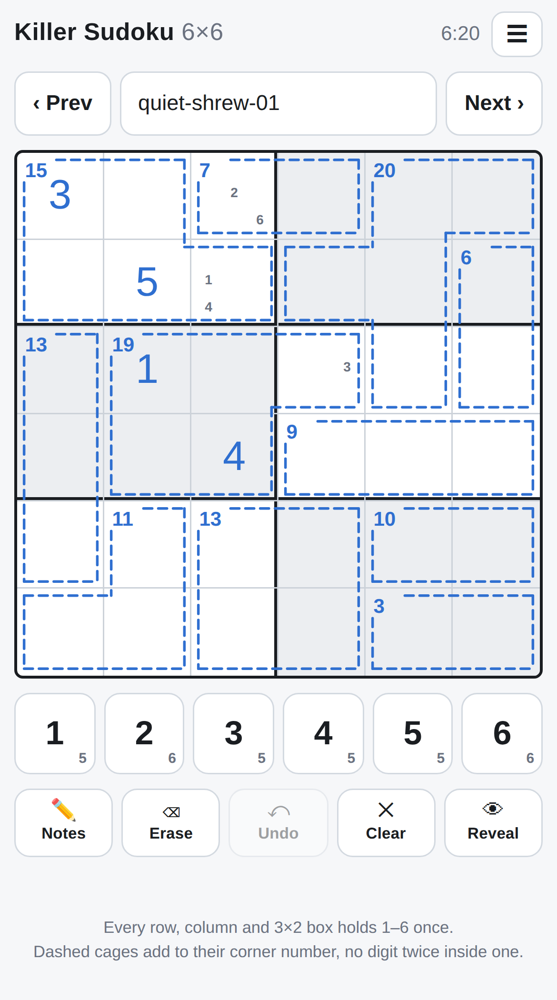
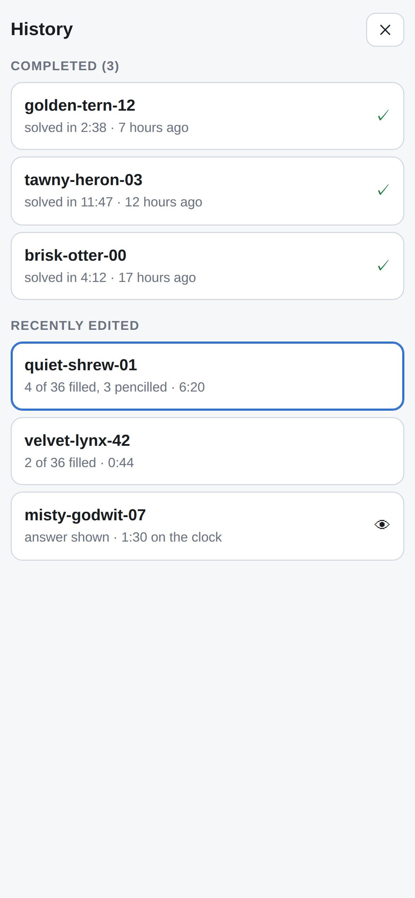
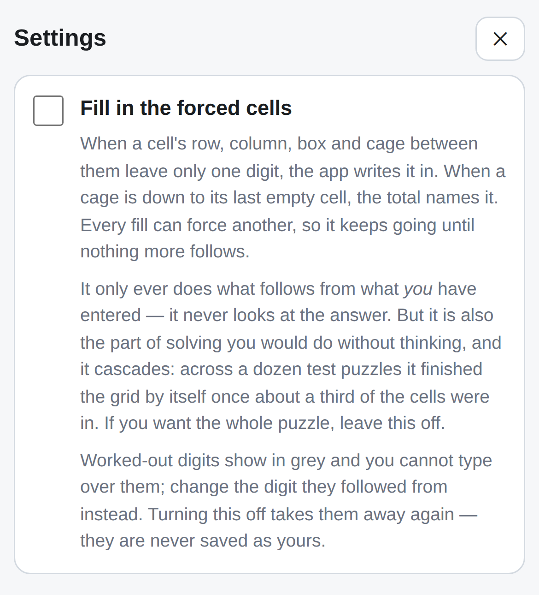
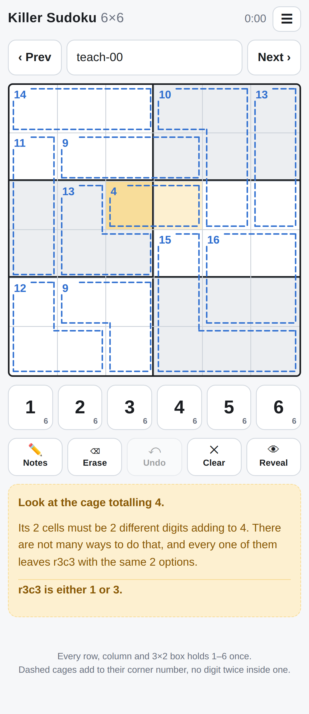

# wac-sudoku

A killer sudoku generator, solver and player, written in [wac](https://github.com/voltrevo/wac).

The generator compiles to WebAssembly and the whole app ships as **one HTML file** — around 116 KB,
with the wasm module inlined as base64. No CDN, no fetches, no service worker, nothing to install.
Type a seed, get a puzzle, solve it on your phone.

**[Play it](https://voltrevo.github.io/wac-sudoku/)**





```
./bootstrap.sh          # dist/index.html
```

Node 22+ is the only prerequisite. There is no `npm install`, because there are no dependencies.

## Playing

Every row, column and 3×2 box holds 1–6 once. The dashed cages add to the small number in their
corner, and no digit repeats inside a cage.

The app prefills a seed as an adjective–animal pair — `brisk-otter`, `tawny-heron` — hashed to a
32-bit integer with FNV-1a. The same seed always produces the same puzzle on any device, and it
lives in the URL hash, so a puzzle is a link. Open the app with no link and it returns to the
puzzle you were last on, grid and all.

Only a browser that has never been here needs a name picked for it, and that one comes from
**today's local date** rather than from chance — so everyone starting fresh on the same day is on
the same puzzle, and Next walks them through the same sequence. Local, not UTC: the day you are
having is the one on your wall, and a player just after midnight should get tomorrow's puzzle
rather than yesterday's.

A seed is a name and a two-digit number: `brisk-otter-07`. Type one without a number and it *is*
that name at `-00`, so **Next** and **Prev** always have somewhere to go. They walk the number and
wrap, which is why Prev from `-00` lands on `-99` rather than refusing — a hundred puzzles per
name, in a ring.

**A hundred puzzles are kept, not just the one on screen**, because Next and Prev make leaving a
puzzle mid-thought the normal way to use this: step forward, get stuck, step back, and your grid is
where you left it. A hundred is one full `-00`…`-99` ring, so Next can lap a name without losing
anything; the next one evicts the least recently opened.

Tap a cell, tap a digit. Notes mode writes pencil marks, which clear themselves from a cell's row,
column, box and cage peers when you commit a digit. One action is one undo however many cells it
moved, so undoing that placement puts the digit *and* every note it rubbed out back. **Clear**
starts the puzzle over, clock included, and is itself one undo away — which is why it does not
stop to ask. The pad counts how many of each digit are left to place. Keyboard works too: `1`–`6`,
arrows, backspace, `N` notes, `U` undo, `[` and `]` for Prev and Next.

The **☰ menu** holds **History**: puzzles you have finished, newest first, with how long each took
and when you did it, then anything still in progress with how far in you are. Tap a row to go back
to it. Revealing is not solving, so a puzzle whose answer you looked at is listed apart from the
ones you finished. **How to play** has the rules and the controls. **Settings** has the assist
below. Below those are [the source](https://github.com/voltrevo/wac-sudoku) and
[the tracker](https://github.com/voltrevo/wac-sudoku/issues/new), both opening in a new tab so a
puzzle in progress is not lost. The title goes to the app root.

### Filling in the forced cells

Off by default, opt in under **Settings**. When a cell's row, column, box and cage between them
leave only one digit, the app writes it in; when a cage is down to its last empty cell, the total
names it. Every fill can force another, so it runs to a fixed point.

**It only ever does what follows from what you entered.** `deriveAuto` has no access to `solution` —
this is the app doing the deduction a solver does without thinking, not the app peeking. It is still
a real assist and it cascades: across a dozen test puzzles it finished the grid by itself once about
a third of the cells were in, which the note beside the checkbox says plainly.

Worked-out digits are held in a separate array from the player's own and shown in grey. That is why
**nothing derived is ever saved** — it is a function of your entries, so it is re-derived on load,
and turning the setting off simply stops deriving it rather than having to unpick anything. You
cannot type over a derived cell; the digit it followed from is the one to change.

Two things it declines to do, both for the same reason — it should not invent a mistake the player
did not make. A cell that nothing fits is left alone, because saying so is the conflict display's
job. And a cage whose total demands a digit that is illegal there is left alone rather than filled
with a knowingly wrong one.

### Hints

**A hint is a deduction, not a lookup.** Nothing behind it can see the solution — it works the board
the way you would and stops at the first thing that follows, which is what lets it say *why*. Three
taps, stop wherever you like:

1. **Where** — highlights a cell, a cage or a region and says nothing else.
2. **Why** — names the reasoning and leaves the arithmetic to you.
3. **Just tell me** — writes the digit in. One Undo takes it back out.

**It reads your pencil marks, and takes them as assertions.** Writing 2 4 5 in a cell says it is one
of those, so every technique reasons from your marks as well as from the digits — which makes hints
sharper the further in you are.

It follows that **a hint can be wrong if a mark is wrong, and that is the design**. Hints reason from
the board, not from the answer. If a mark is mistaken you get walked into a contradiction — a cell
nothing fits, a cage that cannot add up — and finding that out beats being told nothing.

Not every hint is a digit:

- **Rubbing a mark out** is progress, and often the most valuable kind, because a stale mark
  misleads everything after it, hints included.
- **Pencilling a shortlist in** — when a bare cell turns out to have only two or three options — is
  what turns a blank grid into something to reason about.

**Every technique offers what it finds with a price on it, and the cheapest offer wins.** The order
the techniques happen to be written in is not a hierarchy, and while first-match-wins was picking
the answer it was quietly preferring a two-step candidate argument over a two-cell cage adding to 4.
`COST` states the ranking in one place, so "simplest available" is a claim the code can be checked
against rather than an accident. The numbers rise with how many separate facts you must hold at
once, plus a little for how much of the board you have to take in.

The cheap end is a cage down to its last cell, a small cage's total naming the only ways to make it,
a cell only one digit fits, and a mark the grid has already ruled out. Then a digit with one home
left in a row, column or box, region arithmetic, and the cage-combination arguments. Then **a digit
the cage must hold whose every possible home one outside cell can see** — locked candidates, without
the usual requirement that the homes line up on a row.

Then **region arithmetic**. Any one, two or three whole rows, columns or boxes hold 21 each.
Subtract the cages lying wholly inside and what remains is a set of cells whose total is known; add
up every cage that touches it instead and the overflow outside is known the same way. One cell left
over names a digit outright and needs nothing pencilled. After that, the same hunts again over what
the cages have narrowed things to.

**A hint will never use options you have not written down.** Telling you two blank cells "are 1 and
4 in some order" hands over a real deduction for free and then reasons on top of it — the giveaway
would be worth more than the hint riding on it. So the sharper techniques only appear once the cells
involved carry your marks, and an elimination only ever rubs a digit out of a mark already on the
board: **naked pairs and triples**, **hidden pairs**, and the 21 rule where **two** cells poke out,
which fixes what the pair adds to rather than naming a digit.

Last of all, a shortlist for a cell that has no marks — any shortlist, even five digits out of six.
Ruling out one digit is worth having when the alternative is nothing, and since everything above
needs marks to work on, this is the way in as much as it is a hint. Unlike the arguments above, the
options *are* the hint here rather than an unstated premise underneath one.

Cage reasoning enumerates whole assignments against each cell's candidates rather than bare subsets
that add up, which is the difference between running out after two hints and finishing the puzzle.

When nothing fires it says which kind of nothing: a cell with nothing left, a cage that cannot be
filled, or — the interesting one — *nothing follows while your pencil marks stand*, which it can say
because it re-runs the search ignoring them and sees a step appear. **It will never quietly read the
answer to you because it ran out of ideas.**

The invariant is soundness relative to truthful input: given correct entries and marks that always
contain the true digit, no hint may contradict the answer, and none may rub out a true digit.

The sharpest test of that is to hint a **blank** grid to a standstill, because then every digit on
the board came from a hint — so an unsound step shows up as a finished grid that is simply wrong.
Driving 30 puzzles that way, hints only:

Over **300 blank grids**, hints only: **263 finish (88%)**, 37 give up, **0 finish on a wrong
grid**, and all 37 stuck boards still have exactly one solution — so nothing a hint placed was ever
wrong. From four correct digits in it is 30 of 30. A hint costs a fraction of a millisecond.

Over 40 blank grids hinted to a stop, the mix bears the ranking out: cage shortlists 23%, naked
singles 18%, cages down to their last cell 15%, stale marks 10%, hidden singles 9% — and the
two-step arguments that used to dominate now account for under 1%.

The 37 stall at the opening — 32.5 of 36 cells still empty, 72% of those already pencilled. A quad
would help exactly one of them. All 37 have a one-cell contradiction available; whether some of
those restate as direct arguments the way locked candidates did is untested, and assuming they do
not has already been wrong twice.

A blank grid is the worst case by design, since nothing is pencilled and the eliminations have
nowhere to land. Letting them run on cells the player had *not* marked would reach 75%, but that
25% is bought by giving deductions away, which is not what a hint is for. Letting the shortlist
offer any length instead — where the options are the hint rather than its hidden premise — gets most
of it back honestly.

### Teaching mode

Under **Settings**. Keeps a hint on screen the whole time, in full — where to look, why, and what it
comes to — and works it out again every time the board changes.

There is nothing to accept and no sequence to follow. Do what it says or do something else entirely;
the next hint answers whatever you actually did. Make a mistake and it starts telling you about the
mistake. It reads your pencil marks like any hint does, so the more you write down the sharper it
gets.



### Checking your progress

**Check progress** in the menu recolours the digits you have entered — green where the digit is
right, red where it is not. The **?** beside it in the menu opens the explanation
rather than running the check, so nobody finds out what it costs by using it.

It is the only thing besides Reveal that looks at the answer, and the explainer says so. It never
says what the digit should have been.

**While the marks show, rule-red is paused**, so red means one thing at a time: not "clashes with
something" but "this digit is wrong". Nothing is lost by pausing it — two correct digits can never
clash, so every conflict on the board contains a digit the check has already turned red. Checked
over 12,000 random part-filled grids: of 11,114 that had a conflict, none was made only of correct
digits.

Pencil marks are not judged: they are working, not answers. Cells the assist worked out are not
judged either, since they follow from entries rather than being decisions; if one is wrong, the
entry it came from is what gets marked.

The marks last until you change anything, and nothing about a check is counted or saved.

### Not spoiling it

Everything the app tells you comes from the **rules**, never from the answer: a repeated digit in a
house or cage, a cage over its total, a cage full but adding to the wrong number. `conflicts()`
in the page never reads the solution, so a red cell says *this cannot stand*, not *it should have
been a 4*. The solution is read in exactly one function, behind a two-step confirmation — and if
you take it, the finishing message says so rather than congratulating you.

Showing it is not a one-way door: **Undo** puts your own grid back, and **Clear** starts the puzzle
over. Revealing is recorded on the undo stack like any other action.

## What is here

```
src/webgen.wac      the browser entry point: generate(seed) -> i32[]
src/gen.wac         the same generator as a command line, for batches
src/solve.wac       the solver both of those are built on
src/killer.wac      reads a puzzle, solves it, or works out its cages from the printed totals
src/render.wac      a printable HTML sheet of many puzzles
src/state.wac       what you have done to a grid, as bytes
src/text.wac        small shared helpers

web/index.template.html   the app, with one marker where the wasm glue is folded in
web/build.mjs             folds it in
tools/verify.mjs          an independent solver that checks the generator's claim

bootstrap.sh        build everything, fetching a wac compiler if there is not one here
wac-ref.txt         which wac to build with — a branch, tag or commit
```

## Saving

A saved grid is **forty-odd bytes**, and the page never looks inside it: `packState` in wac returns
an opaque `Uint8Array` and `unpackState` takes it back. The layout is `src/state.wac`'s business.

It is small because **the answer is not in it**. The seed regenerates the solution, so a cell
filled in correctly costs one bit — *filled* — and only the cells you have got wrong carry a digit.
What remains is two bit vectors and a short list:

```
0        version
1-2      a fingerprint of the answer this state was saved against
3-7      which cells are filled            36 bits
8-34     pencil marks, six bits per cell   216 bits
35-37    seconds on the clock              24 bits
38       flags — bit 0 `revealed`, bit 1 `solved`
39       how many cells are wrong, W
40-43    solved at, unix seconds           32 bits, zero if it never was
44-46    solved in, seconds on the clock   24 bits
47..     one byte each: cell * 6 + digit - 1, which fits because 36 * 6 = 216 < 256
```

Forty-seven bytes covers every realistic state, including a grid pencilled in every cell with all
six candidates — which the JSON this replaced spent 611 characters on. A hundred puzzles is 4.8 KB.

When it was solved and how long it took are kept apart from the running clock, because Clear resets
the clock and starting a solved puzzle over should not un-solve it in the history. Everything the
history list shows lives in this header, so `summaryState` reads a row straight out of the bytes —
no solution, and so no regenerating a hundred puzzles to draw a list. Only the *digits* need the
answer, and a list does not show digits.

Version 1 states are still read, so nothing saved before the completion fields existed is thrown
away for being old.

The fingerprint earns its two bytes: nothing pins a seed to the puzzle it produced, so if the
generator ever changes, `brisk-otter-00` becomes a different grid. Without it the old state would
decode against the new answer and quietly move your digits around. A mismatch is read as "no saved
state" instead.

Storage is **IndexedDB**, which keeps a byte array as bytes rather than stringifying it — and
`github.io` is a single origin for every project published under it, so the localStorage budget was
never ours alone. Everything is mirrored in memory at startup, so reads are synchronous and only
writes go to disk, coalesced.

Anything the localStorage version left behind is migrated once. The old keys are removed only after
the new bytes are **on disk** — the transaction is awaited rather than queued, because a coalesced
write that had not landed would have taken the grids with it if the tab closed in between. A failed
write leaves the originals alone and the next visit tries again.

The migration is stamped `2026-09-07` and stops running sixty days later. Past that it is dead code:
delete `migrate`, `forgetOld`, the three constants and the one call, and nothing else refers to
them. The trade is deliberate — someone who has not opened the app for two months loses grids saved
under the old format.

**Undo is not saved and is not meant to be.** It lives in memory for one puzzle: `build()` resets it
on every switch, so it never outlives the grid it describes.

### More than one tab

**A tab only writes a puzzle it has itself changed.** `save()` runs from `draw()`, and `draw()` runs
on things that are not edits — selecting a cell, stepping to the next puzzle, the tab being hidden.
With the store mirrored from when the tab loaded, an old tab left open in the background would write
its stale, empty grid over work done in another one, on nothing more than a tap.

A tab that has been away catches up before it does anything: it re-reads on becoming visible, and on
a `BroadcastChannel` message from whichever tab last wrote. It adopts what it finds unless it has
edits of its own, which are the one thing it should not discard unasked. The recency list is merged
rather than replaced, and eviction happens against the merged list, so one tab cannot delete a
puzzle another one knows about.

What is left: **two tabs actively editing the same puzzle still diverge, and the last write wins.**
Neither view is wrong and nothing merges grids, so the honest thing is to say so rather than pick.

## How a puzzle is made unique

Uniqueness is not tested after the fact and retried until it holds. It is preserved at every step,
which is why the generator never has to reject a finished puzzle:

1. Make a filled 6×6 grid — a base pattern, then digit relabelling and band, stack, row and column
   shuffles, which are the symmetries that keep it valid.
2. Start with every cell its own one-cell cage. That is trivially unique: every digit is given.
3. Repeatedly merge two touching cages and re-count the solutions. Keep the merge only if the count
   is still exactly one; otherwise put it back.

Step 3 walks *down* from a fully-given puzzle rather than up from an empty one, so the invariant
holds from the start. A final sweep merges away any one-cell cages left over, since those are free
givens rather than puzzle. `tools/verify.mjs` re-checks all of this from outside, with a search
written to be deliberately dumber than `src/solve.wac`'s — it does not reproduce the cage
range-pruning, which is the part most able to prune a real second solution away and report a
puzzle unique when it is not.

## Command line

```sh
wac run src/gen.wac -- 20 20260906              # 20 puzzles, seeded
wac run src/gen.wac -- 20 1 | wac run src/render.wac > puzzles.html
wac run src/killer.wac < examples/twenty.txt    # solve, and count the solutions
```

`killer.wac` also derives cage shapes it was never told. `examples/photographed.txt` is a puzzle
transcribed from a newspaper photograph — only the printed totals and where they sat, because the
cage outlines were not legible:

```sh
wac run src/killer.wac < examples/photographed.txt
```

It recovers the layout, because eleven totals adding to 126 = 6 × 21 can only be a partition of all
36 cells, and because a cage's total is printed in its topmost-then-leftmost cell.

## Building

`bootstrap.sh` looks for a wac compiler in `$WAC`, then on `PATH`, then in `.wac/`. Finding none, it
fetches wac and runs *its* `bootstrap.sh --host nodejs`, which builds the compiler from source by a
ladder whose lowest rung is hand-written wasm assembly text — no cargo, no C++ toolchain, and
nothing unpacks a binary that somebody compiled once and checked in. About 50 seconds cold, and
cached in `.wac/` afterwards.

```sh
./bootstrap.sh --verify        # ...and check the generated puzzles
./bootstrap.sh --clean         # throw away .wac/, dist/ and the generated glue
WAC=/path/to/wac ./bootstrap.sh
```

Then `wac bindgen src/webgen.wac --js` writes `src/webgen.gen.js`, with the compiled module inlined
as base64 and a plain `export function generate(seed)` over it. `web/build.mjs` drops that into the
template. Instantiation is synchronous, so there is no loading state to design.

## Deploying

`.github/workflows/pages.yml` runs `./bootstrap.sh --verify` and publishes `dist/`. It is the same
command a laptop runs, so if CI and a local build ever disagree, the disagreement is in the
environment rather than in two descriptions of the same steps that drifted apart.

Enable it once under **Settings → Pages → Source → GitHub Actions**. The compiler is cached on the
contents of `wac-ref.txt`, so it rebuilds when that moves and not otherwise.
